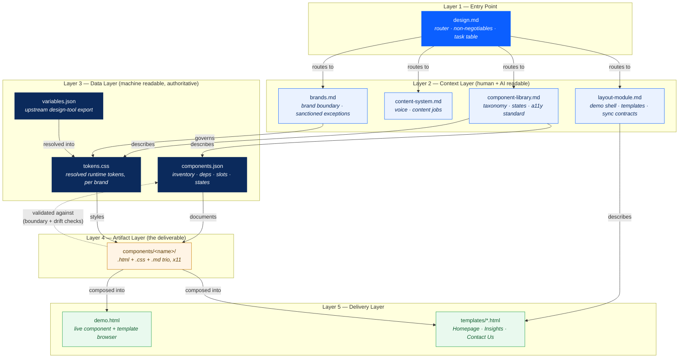

# Ecosystem Flow

How `design.md`, the context layer, the data layer, and the
component artifacts relate. Five layers, one feedback loop.

## Reading the diagram

**Downward arrows (solid)** are the normal path: `design.md`
routes to the context layer, the context layer describes the
data layer, the data layer documents and styles the artifacts,
and the artifacts compose into what ships.

**The dashed arrow is the loop that makes this a system rather
than a pile of docs.** `components.json` isn't just descriptive —
it's checked against the real artifact files (do the declared
variants actually exist in the HTML? does the declared bridge
namespace actually appear in the CSS? are the declared
dependencies actually linked?). When that check fails, the data
layer is wrong and gets fixed — not the other way around. This
loop is what prevented the inventory-table drift that happened
repeatedly before `components.json` existed.

**Two things never point upward:** artifacts never describe
themselves back into the context layer (a component's own `.md`
file documents *content*, not architecture), and the delivery
layer (demo, templates) never feeds back into anything — it's a
pure consumer, disposable and regenerable at any time.

## Layer summary

| Layer | Files | Authoritative for | Consumed by |
|---|---|---|---|
| 1 — Entry | `design.md` | Task routing, non-negotiables | Anyone/anything starting work |
| 2 — Context | `component-library.md`, `content-system.md`, `layout-module.md`, `brands.md` | System reasoning, standards, voice | Humans, AI sessions |
| 3 — Data | `components.json`, `tokens.css`, `variables.json` | Structured facts, resolved values | Layer 2 docs, Layer 4 artifacts |
| 4 — Artifact | `components/<name>/` (×11) | The actual deliverable | Layer 5 |
| 5 — Delivery | `demo.html`, `templates/*.html` | Nothing — pure composition | End users, stakeholders |
